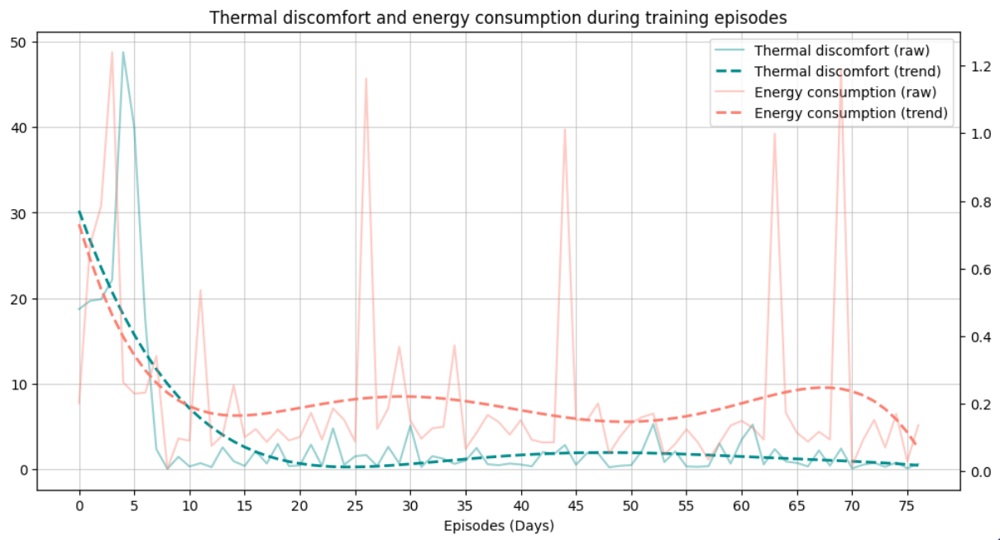

# ⚡🏡 HVAC control with DQN and BOPTEST ⚡🏡

Welcome to the **HVAC control with DQN** project! This repository demonstrates how to use the Deep Q-Network (DQN) algorithm from [Stable-Baselines3](https://stable-baselines3.readthedocs.io/) to optimize a building's HVAC system in a custom Gym environment provided by the [BOPTEST project](https://ibpsa.github.io/project1-boptest/software/).

> [!IMPORTANT]  
> This project uses version 0.6.0 of BOPTEST and BOPTEST-gym. Be careful since BOPTEST v0.7.0 has been released recently and BOPTEST-gym is still being updated to support it, check status on [`boptest-gym issue#155`](https://github.com/ibpsa/project1-boptest-gym/issues/155)

## 💡 How it works

### Agent training
- **Phase 1**: The initial agent learns using a simple reward function focused solely on reducing thermal discomfort.
- **Phase 2**: A more complex agent learns to balance thermal comfort and energy efficiency.

📂 **Check out the full training process**: Dive into the details by opening [`main.ipynb`](./main.ipynb).

### Results
Below are the results showcasing the thermal discomfort (in blue) and energy utilitzation (in red) of the two agents during their training episodes.


#### First agent (Thermal discomfort optimization)
<p>
  
</p>

#### Second agent (Thermal discomfort + Energy efficiency optimization)
<p>
  
</p>

## 🚀 Getting started

Follow these steps to set up and run the project:

### 1. Set up python environment

#### 🐧 If you’re a regular a linux user:
1. Install [`uv`](https://docs.astral.sh/uv/getting-started/installation/).
2. Run:
   ```bash
   uv venv
   uv sync
   ```
3. A Python virtual environment will be created at `.venv`.

#### ❄ If you are a NixOS user:
1. Run:
   ```bash
   nix develop
   uv venv
   uv sync
   ```
2. A Python virtual environment with CUDA will be created at `.venv`.

### 2. Set Up BOPTEST Web Service

1. Clone the BOPTEST service repository:
   ```bash
   git clone https://github.com/NREL/boptest-service
   ```
2. Navigate to the project directory:
   ```bash
   cd boptest-service
   ```
3. Start the web service using Docker:
   ```bash
   docker compose up web worker provision
   ```

## 📚 Resources

- **BOPTEST documentation**: Learn more about the [BOPTEST project](https://ibpsa.github.io/project1-boptest/software/).
- **BOPTEST web service documentation**: Steps to deploy simulation environment [BOPTEST-service project](https://github.com/NREL/boptest-service?tab=readme-ov-file#building-and-running-on-a-personal-computer).
- **BOPTEST gym environment documentation**: More info about the custom gym environment [BOPTEST-gym project](https://github.com/ibpsa/project1-boptest-gym).
- **Stable-Baselines3 Documentation**: Get familiar with [DQN](https://stable-baselines3.readthedocs.io/en/master/modules/dqn.html) and other algorithms.
